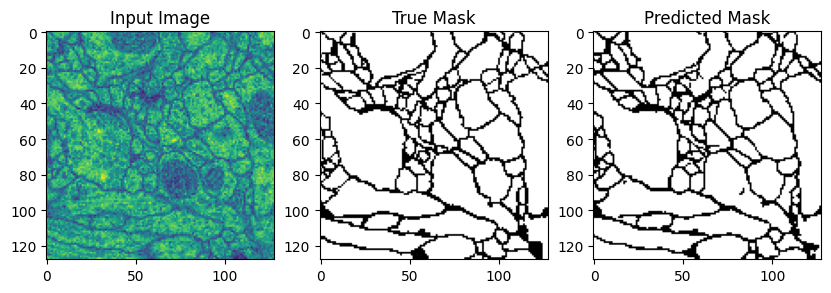

# 🔬 Cell Segmentation — U-Net (PyTorch Lightning)

> Segmentation of cell membranes on electron-microscopy images using a **U-Net** convolutional network, trained with **PyTorch Lightning** on the **ISBI-2012** challenge dataset.

<p align="center">
  
</p>

<p align="center">
  <em>Left → right: input EM slice · ground-truth mask · model prediction — final training accuracy ≈ <b>91.6%</b></em>
</p>

<p align="center">
  
  
  
  
</p>

---

## 📖 Overview

This project implements a **U-Net** — the reference encoder–decoder architecture for biomedical image segmentation — to separate cell membranes from cell interiors in serial-section Transmission Electron Microscopy (ssTEM) images of the *Drosophila* larva ventral nerve cord.

The full workflow lives in [`implementation.ipynb`](implementation.ipynb):

1. **Data** — download & load the ISBI-2012 volume (30 grayscale slices + membrane masks)
2. **Augmentation** — resize to 128×128, random flips, normalization (via *Albumentations*)
3. **Model** — a configurable U-Net (encoder / bottleneck / decoder with skip connections)
4. **Training** — 100 epochs, Adam optimizer, `BCEWithLogitsLoss`, `BinaryAccuracy` metric
5. **Evaluation** — threshold the sigmoid output and visualize *input · ground truth · prediction*

## 🖼️ Results

| Dataset sample | Segmentation prediction |
|:---:|:---:|
|  |  |

The predicted membrane maps closely follow the ground-truth annotations, correctly recovering the cell boundaries and the overall topology of the tissue.

## 🧠 Model architecture

A classic U-Net with a symmetric encoder–decoder and skip connections:

```
Input (1×128×128)
  └─ Encoder: 4 × Down blocks   (Conv → BN → ReLU) ×2 + MaxPool     [64 → 128 → 256 → 512]
       └─ Bottleneck: 2 × ConvBlock                                 [1024]
            └─ Decoder: 4 × Up blocks (ConvTranspose + skip concat) [512 → 256 → 128 → 64]
                 └─ OutConv (1×1 conv) → 1 channel logits
```

Building blocks (see cell 8 of the notebook):

- **`ConvBlock`** — `Conv2d(3×3) → BatchNorm → ReLU`
- **`Down`** — two `ConvBlock`s + `MaxPool2d`, returns the pooled tensor **and** the skip
- **`Up`** — `ConvTranspose2d` upsample, concatenate the skip, two `ConvBlock`s
- **`OutConv`** — `1×1` convolution mapping to `n_classes` logits
- **`UNetModule`** — a `pl.LightningModule` wiring it all together (`training_step`, `validation_step`, `configure_optimizers`)

| Hyperparameter | Value |
|---|---|
| Input channels | 1 (grayscale) |
| Base filters | 64 |
| Depth (blocks) | 4 |
| Image size | 128 × 128 |
| Loss | `binary_cross_entropy_with_logits` |
| Optimizer | Adam (`lr = 1e-3`) |
| Epochs | 100 |

## 🚀 Getting started

### Requirements

```bash
pip install pytorch-lightning torch torchvision opencv-python albumentations tifffile torchmetrics matplotlib
```

### Run

Open the notebook in Jupyter or Google Colab (a GPU — e.g. Colab's T4 — is recommended):

```bash
jupyter notebook implementation.ipynb
```

The first cells automatically download the ISBI-2012 dataset:

```bash
wget https://downloads.imagej.net/ISBI-2012-challenge.zip
```

Then run the cells top-to-bottom to prepare the data, train the model, and visualize the predictions.

## 📁 Project structure

```
Cell_Segmentation/
├── implementation.ipynb     # End-to-end notebook (data → model → training → viz)
├── README.md
└── docs/                     # Portfolio website (deployable via GitHub Pages)
    ├── index.html
    └── assets/               # Result images
```

## 🌐 Portfolio site

A small showcase website lives in [`docs/`](docs/). To publish it:

1. Go to **Settings → Pages** in the GitHub repository
2. Set **Source** to `Deploy from a branch`, branch `main`, folder `/docs`
3. The site becomes available at `https://<user>.github.io/Cell_Segmentation/`

## 📚 Dataset & references

- **ISBI-2012 Challenge** — *Segmentation of neuronal structures in EM stacks* — https://downloads.imagej.net/ISBI-2012-challenge.zip
- Ronneberger, Fischer & Brox — *U-Net: Convolutional Networks for Biomedical Image Segmentation* (2015)
- [PyTorch Lightning documentation](https://lightning.ai/docs/pytorch/stable/)
- Reference config: [SAM2-UNet](https://github.com/WZH0120/SAM2-UNet)

## 📝 License

Educational / lab project. Feel free to use and adapt.
