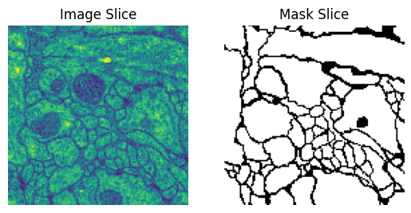

# 🔬 Cell Segmentation : U-Net (PyTorch Lightning)

> Segmentation des membranes cellulaires sur des images de microscopie électronique, avec un réseau **U-Net** entraîné via **PyTorch Lightning** sur le dataset **ISBI-2012**.

<p align="center">
  
</p>

<p align="center">
  <em>De gauche a droite : image d'entree · masque de verite terrain · prediction du modele.</em>
</p>

<p align="center">
  
  
  
  
</p>

---

## 📖 Vue d'ensemble

Ce projet implémente un **U-Net**, l'architecture encodeur / décodeur de référence pour la segmentation d'images biomédicales, afin de séparer les membranes cellulaires de l'intérieur des cellules sur des images de microscopie électronique (ssTEM) du système nerveux de la larve de *Drosophila*.

Tout le workflow vit dans [`implementation.ipynb`](implementation.ipynb) :

1. **Données** : téléchargement et chargement du volume ISBI-2012 (30 coupes en niveaux de gris + masques de membranes).
2. **Augmentation** : redimensionnement, retournements, déformation élastique et normalisation (via *Albumentations*).
3. **Modèle** : un U-Net configurable (encodeur, goulot, décodeur avec connexions résiduelles).
4. **Entraînement** : perte combinée BCE + Dice, optimiseur Adam, planificateur de learning rate, early stopping et sauvegarde du meilleur checkpoint.
5. **Évaluation** : seuillage de la sortie, mesure du Dice et de l'IoU, puis visualisation *entrée · vérité terrain · prédiction*.

## 🖼️ Résultats

| Échantillon du dataset | Prédiction de segmentation |
|:---:|:---:|
|  |  |

Les masques prédits suivent de près les annotations, retrouvant les frontières entre cellules et la topologie globale du tissu.

> Note : les images ci-dessus proviennent d'un premier entraînement. Après avoir relancé le notebook amélioré, elles seront régénérées avec le nouveau modèle (Dice et IoU affichés).

## 🧗 Les difficultés du problème

Ce dataset est petit et exigeant. Les principaux obstacles, et la réponse apportée dans le code :

| Difficulté | Pourquoi c'est dur | Réponse dans le code |
|---|---|---|
| Très peu de données | 30 coupes annotées seulement, sur-apprentissage rapide | Augmentation forte (déformation élastique du papier U-Net) + dropout |
| Classes déséquilibrées | Membranes fines, la plupart des pixels sont du fond | Perte **BCE + Dice**, métriques **Dice** et **IoU** |
| Frontières au pixel près | Séparer des cellules collées sans les fusionner | Connexions résiduelles du U-Net qui ramènent les détails fins |
| Pas de labels de test publics | Impossible de mesurer la vraie généralisation naïvement | Coupes mises de côté en **validation** + **early stopping** |

## 🧠 Architecture du modèle

Un U-Net classique, encodeur / décodeur symétrique avec connexions résiduelles :

```
Entrée (1×256×256)
  encodeur : 4 blocs Down   (Conv, BN, ReLU) ×2 + MaxPool     [64, 128, 256, 512]
    goulot : 2 ConvBlock + Dropout                            [1024]
      décodeur : 4 blocs Up (ConvTranspose + concat du skip)  [512, 256, 128, 64]
        OutConv (conv 1×1)  ->  1 canal de logits
```

Blocs de base (cellule modèle du notebook) :

- **`ConvBlock`** : `Conv2d(3×3)`, `BatchNorm`, `ReLU`.
- **`Down`** : deux `ConvBlock` + `MaxPool2d`, renvoie le tenseur réduit **et** le skip.
- **`Up`** : upsample `ConvTranspose2d`, concaténation du skip, deux `ConvBlock`.
- **`OutConv`** : convolution `1×1` vers `n_classes` logits.
- **`DiceLoss`** : perte d'overlap, robuste au déséquilibre des classes.
- **`UNetModule`** : le `pl.LightningModule` qui relie tout (`training_step`, `validation_step`, `configure_optimizers`).

| Hyperparamètre | Valeur |
|---|---|
| Canaux d'entrée | 1 (niveaux de gris) |
| Filtres de base | 64 |
| Profondeur | 4 blocs |
| Taille image | 256 × 256 |
| Perte | BCE + Dice |
| Métriques | Dice (F1), IoU (Jaccard) |
| Optimiseur | Adam (`lr = 1e-3`, `weight_decay = 1e-5`) |
| Planificateur | ReduceLROnPlateau |
| Époques max | 80 (avec early stopping) |

## 🚀 Démarrage

### Prérequis

```bash
pip install pytorch-lightning torch torchvision opencv-python albumentations tifffile torchmetrics matplotlib
```

### Lancer

Ouvrez le notebook dans Jupyter ou Google Colab (un GPU, par exemple le T4 de Colab, est recommandé) :

```bash
jupyter notebook implementation.ipynb
```

Les premières cellules téléchargent automatiquement le dataset ISBI-2012 :

```bash
wget https://downloads.imagej.net/ISBI-2012-challenge.zip
```

Exécutez ensuite les cellules de haut en bas pour préparer les données, entraîner le modèle et visualiser les prédictions.

## 📁 Structure du projet

```
Cell_Segmentation/
├── implementation.ipynb     # Notebook complet (donnees -> modele -> entrainement -> viz)
├── README.md
└── site/                     # Site vitrine (deployable via GitHub Pages)
    ├── index.html
    └── assets/               # Images de resultats
```

## 🌐 Le site

Un petit site vitrine vit dans le dossier [`site/`](site/). Ouvrez [`site/index.html`](site/index.html) dans un navigateur pour le voir.

> Note : GitHub Pages ne peut déployer que depuis la racine du dépôt ou un dossier nommé `/docs`. Pour publier le site en ligne, renommez `site/` en `docs/`, ou déplacez son contenu à la racine, avant d'activer **Settings → Pages**.

## 📚 Dataset et références

- **ISBI-2012 Challenge**, *Segmentation of neuronal structures in EM stacks* : https://downloads.imagej.net/ISBI-2012-challenge.zip
- Ronneberger, Fischer & Brox, *U-Net: Convolutional Networks for Biomedical Image Segmentation* (2015)
- [Documentation PyTorch Lightning](https://lightning.ai/docs/pytorch/stable/)
- Config de référence : [SAM2-UNet](https://github.com/WZH0120/SAM2-UNet)

## 📝 Licence

Projet éducatif / de laboratoire. Libre d'utilisation et d'adaptation.
